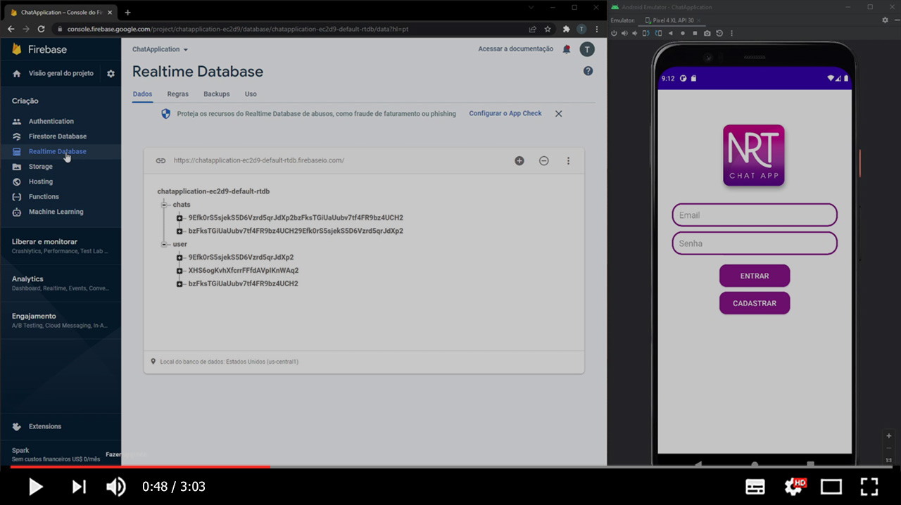
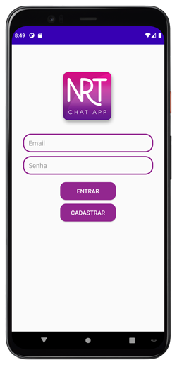
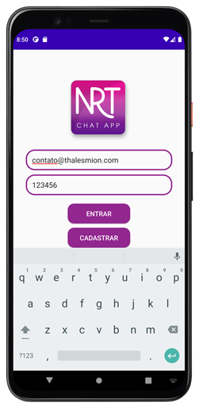
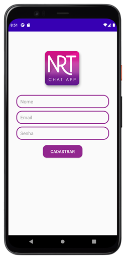
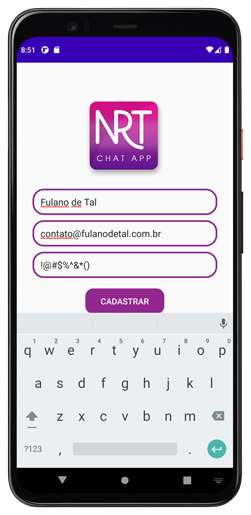
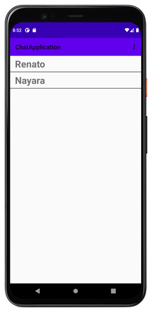
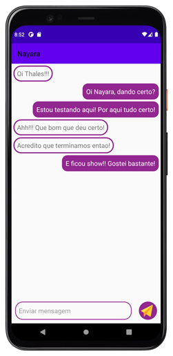

# Programação IV - Chat Application
Trabalho prático em grupo desenvolvido para a disciplina de Programação IV durante a graduação de Sistemas de Informação pela UEMG (Universidade do Estado de Minas Gerais).

**Colaboradores:**
[Nayara Proença](https://github.com/NayaraProenca) | [Renato Soares](https://github.com/RenSoares) | [Thales Nunes](https://github.com/thalesonunes)

------

#  Chat Application

O projeto consiste no desenvolvimento de uma aplicação mobile de Chat, utilizando o Android Studio.

------

### :rocket: Funcionalidades:

- Cadastro de usuários
- Acesso de usuários com autenticação via Firebase
- Seleção de usuário para troca de mensagens
- Enviar mensagem
- Sair do aplicativo

------

### :rocket: Recursos utilizados:

- Android Studio
- Linguagem Kotlin
- Firebase Authentication para gerenciar os cadastros e acessos dos usuários
- Firebase Realtime Database para armazenar conversas e usuários

------

### :rocket: Preview:

##### Clique na imagem abaixo para ver o vídeo de apresentação:

##### Telas da aplicação:

------

###  :rocket: Contato:

Alguma dúvida, crítica ou elogio? Não hesite em entrar em contato. Será um prazer conversar a respeito!

 [Whatsapp](https://api.whatsapp.com/send?phone=5535997438652) |  [E-mail](mailto:thales.o.nunes@gmail.com)